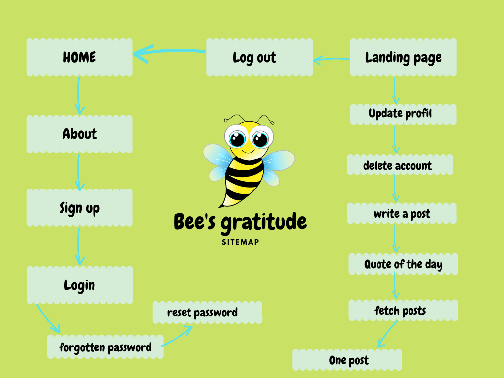

# The bee's gratitude website :

### Link: https://bees-gratitude.herokuapp.com/  

## Demo

https://user-images.githubusercontent.com/50797024/174048866-33ae403d-86d4-4477-aa01-bb81f9e2dda6.mp4

## if you want to explore the website as visitor use:
* email: visitor@example.com 
* password: visitor21#

- ### [The application's features](#the-applications-features-1)
- ### [Development process](#development-process-)
- ### [Programming concepts applied](#programming-concepts-applied-)

## The application's features:

## Development process :
 * This is a dynamic website with authentification that allows the user to keep a daily journal of gratitude:
   - It's limited to 50 accounts, 100 posts per account.
   - The user can add only one post per day.
 * Build a wireframe design of the website for different devices.
 * Create a Postgres dataBase: account information and posts.
 * Use Javascript Modules to manage the js of each page.
 * Build PHP classes account, connexion, post, and router.
 * Use a router to fetch pages.
 * Manage the forms errors while typing.
 * Create an animation for the selected form.
 * Reset passwords with a generated random token.
 * Build a customized error page.
 * rewrite urls in .htaccess.
 * Create a javascript function that tracks the user activity and ends the session after ten minutes of no activity.
 * implement a feature that allows the user to update his profile with a new picture if wanted.
 * implement a feature that allows the user to delete his account.
 * Build a function that fetches a random quote on the landing page using : the quotable API : https://github.com/lukePeavey/quotable 
 * Implement a js function that styles the fetched database contents on load.

## Programming concepts applied :
CSS | JavaScript | PHP| Postgres
-----|--------|----|-----|
GRID |Modules ES6|MVC|create database
FLEXBOX|AJAX|OOP|database queries
animations|JSON|superglobals|SQL Data Types
Responsive design|classes|PHP include|SQL Dates
||regex|array methods|SQL FOREIGN KEY
||arrays methods|PHP filters|SQL Joins
|| string methods|PHP file|SQL PRIMARY KEY
||date|PHP sessions||
||formData object|PHP PDO|
||window object|time()|
||files|PHP mail()|
|||regex|
